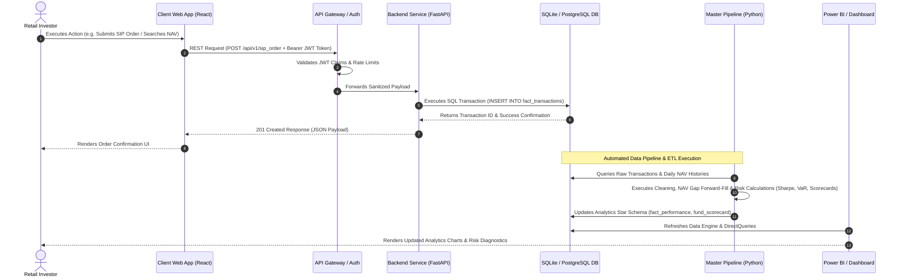

# Software Architecture & Data Flow Diagram — Bluestock FinTech Platform

## Overview
This architecture document details the end-to-end data flow in a modern FinTech application, tracing how a user action on a Web/Mobile Client progresses through Client-Server APIs, Authentication gateways, Microservice Backends, Relational Databases, Data Engineering Pipelines, and finally renders on Executive Analytics Dashboards.

---

## 1. System Architecture Components

```
┌──────────────────────────────────────────────────────────────────────────────────┐
│                             CLIENT LAYER (Frontend UI)                            │
│   Web App (React/Next.js)  │  Mobile App (Flutter)  │  Streamlit App (Python)    │
└────────────────────────────────────────┬─────────────────────────────────────────┘
                                         │ HTTPS / REST / WebSockets
                                         ▼
┌──────────────────────────────────────────────────────────────────────────────────┐
│                      API GATEWAY & AUTHENTICATION LAYER                          │
│   Kong / NGINX Gateway  │  OAuth2 / JWT Token Validation  │  Rate Limiting       │
└────────────────────────────────────────┬─────────────────────────────────────────┘
                                         │ JSON Payloads (POST/GET)
                                         ▼
┌──────────────────────────────────────────────────────────────────────────────────┐
│                            BACKEND SERVICES LAYER                                │
│   Trading Service (FastAPI) │ Order Engine (Node.js) │ User Analytics Service     │
└───────────────────┬──────────────────────────────────────────────┬───────────────┘
                    │ Read/Write Transactions                      │ Change Data Capture
                    ▼                                              ▼
┌──────────────────────────────────────┐        ┌──────────────────────────────────┐
│      RELATIONAL DATABASE LAYER       │        │     DATA ENGINEERING PIPELINE    │
│   PostgreSQL / SQLite Star Schema    │        │  Apache Airflow / Python ETL     │
│   (dim_fund, fact_transactions, etc) │        │  (Ingestion -> Cleaning -> Math) │
└──────────────────────────────────────┘        └────────────────┬─────────────────┘
                                                                 │ Aggregated Data
                                                                 ▼
                                                ┌──────────────────────────────────┐
                                                │        ANALYTICS DASHBOARD       │
                                                │  Power BI (.pbix) / Streamlit    │
                                                └──────────────────────────────────┘
```

---

## 2. End-to-End Data Flow Sequence (User Action to Dashboard)



---

## 3. Core Software Engineering Concepts Explained

1. **Client-Server Architecture**: Separation of concerns between user interface presentation (Client) and business logic execution (Server).
2. **REST APIs & JSON**: Representation State Transfer protocol utilizing standard HTTP methods (`GET` for fetching data, `POST` for creating resources, `PUT`/`PATCH` for updates, `DELETE` for removal) transmitting structured JSON key-value payloads.
3. **Database Star Schema**: Multi-dimensional schema comprising Central Fact Tables (`fact_transactions`, `fact_nav`) linked via foreign keys to Dimension Tables (`dim_fund`, `dim_date`) optimized for OLAP analytics queries.
4. **Data Pipelines & Logging**: Automated Python/ETL workflows featuring error logging, transaction rollback, and empirical data validation.
